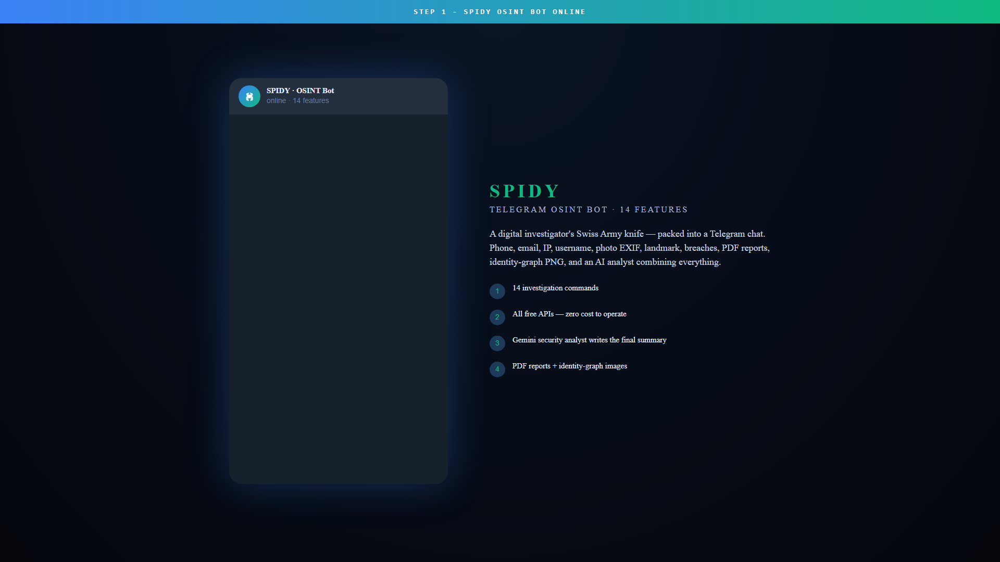

# 🕷️ SPIDY

### Telegram OSINT Bot — 14 Cyber-Investigation Tools in One Chat

-orange?style=flat-square)

---

> ## 🔒 Source code is private — request access via my GitHub profile.

---

## What is SPIDY

SPIDY is a digital investigator's **Swiss Army knife inside Telegram**. Send it a phone, email, username, IP, photo, or URL — it instantly pulls publicly-available data and writes you a full intelligence dossier.

14 features. Free APIs only. Zero ongoing cost.

## Demo

https://github.com/user-attachments/assets/647dfa38-7272-476d-a10a-3c6c3b69364b

## The 14 features

| Command | Purpose |
|---------|---------|
| `/phone` | Carrier · country · region · spam-flag check |
| `/email` | Domain · MX · breach (HIBP) · gravatar |
| `/ip` | Geo · ASN · abuse-DB reputation |
| `/username` | Cross-platform footprint (Sherlock-style) |
| `/exif` | Photo metadata: camera, GPS |
| `/landmark` | GPS → landmark name |
| `/url` | Phishing/safety verdict |
| `/whois` | Domain ownership history |
| `/dns` | A · MX · NS · TXT records |
| `/breach` | "Have I Been Pwned" check |
| `/pivot` | Cross-link findings into one graph |
| `/pdf` | Generate a full PDF report |
| `/graph` | Identity graph as PNG image |
| `/analyse` | **AI analyst** — Gemini summarises everything |

## Why SPIDY exists

Most OSINT tools require coding, multiple installs, and scattered configs. SPIDY puts the 14 most-useful investigations behind **one Telegram bot anyone can use** — even non-technical cyber students or analysts.

## Stack

- Python + `python-telegram-bot`
- Gemini API for the AI security analyst
- ReportLab for PDF reports + Pillow for identity-graph PNGs
- All other APIs use free tiers (NumVerify, EmailRep, AbuseIPDB, HIBP, Shodan...)

## Contact

For source-code access or bot invite link, reach out via my GitHub profile.

## Licence

(c) 2026 Danish · All rights reserved.
